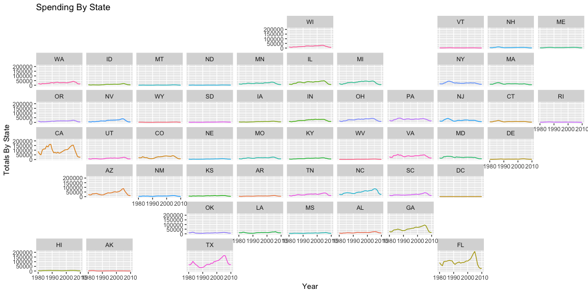

```r
# Use this R-Chunk to import all your datasets!

permit <- permits
usa <- us_states()
```

## Background

You have been asked to support a story for the local paper (that has a web presence) that looks back on the housing collapse and the early effects of residential construction. You have data on residential building permits from 1980 through 2010 for each county in the United States. Your colleague that is writing the article would like a few maps and graphics that highlight the single family building permit patterns across your state as well as the patterns in the US.

Remember the big story is the collapse of new building permits at the initial stages of the mortgage crisis. Make sure your graphics highlight the collapse in a clear and honest manner.

## Data Wrangling


```r
# Use this R-Chunk to clean & wrangle your data!
permit <- permit %>%
  filter(variable == "Single Family")

usa$statefp <- as.numeric(usa$statefp)

usa <- usa %>%
select(statefp, geometry)


show <- permit %>%
  group_by(StateAbbr, state, year) %>%
  summarize(total = sum(value))
  

show <- show %>%
  left_join(usa, by = c('state' = 'statefp'))

usa <- permit %>%
  group_by(year) %>%
  summarize(total = sum(value)) %>%
  mutate(change = total / lag(total, 1) -1)

usa <- na.omit(usa)
```

## Data Visualization


```r
# Use this R-Chunk to plot & visualize your data!
show %>%
  ggplot(aes(year, total, col = StateAbbr)) + geom_line() + 
  facet_geo( ~ StateAbbr) + labs(x = "Year",
                                 y = "Totals By State",
                                 main = "Changes in Spending Overtime by State") +
  labs(title = "Spending By State") +
  theme(legend.position = "none")
```

<!-- -->

## Graphic 1:

The graphic above shows spending by each state on single family residences. The highest states are California, Florida, and Texas. A noticeable trend is that all of these states were hit very hard during the 2008 recession where single family residencies dropped dramatically. However, most states haven't experienced the level of spending that the 3 originally mentioned have.


```r
usa %>%
  ggplot(aes(x = year, change)) +
  geom_line(color = "blue") + scale_x_continuous(seq(1980,2010,1)) +
  theme_minimal() + labs(x= "Year", 
                         y = "Yearly Percent Change",
                         title = "USA Residential Growth (By Percent Change") 
```

<!-- -->

## Graphic 2:
The 2008 recession was catastropic, it came as a surprise to many as the United States was experiencing high levels of growth. It came to a dramatic change and development rapidly slowed. After it bottomed out, it showed a quick bounce back. This is useful graphic as it shows increases and decreases in overall development.
